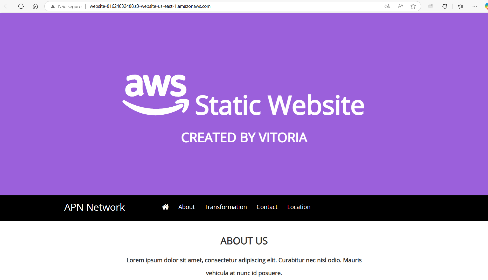

🌐 Site Estático Hospedado no Amazon S3

Este projeto demonstra como hospedar um site estático utilizando o Amazon S3. O site foi criado durante um laboratório guiado da AWS Academy, contendo arquivos básicos de HTML, CSS e JavaScript.

## Tecnologias e Ferramentas Utilizadas:
- HTML5  
- CSS3  
- JavaScript  
- Amazon S3 (Hospedagem de Site Estático)  
- Listas de Controle de Acesso (ACLs)

## O que foi feito:
- Criação de um bucket no Amazon S3  
- Ativação da hospedagem de site estático  
- Upload dos arquivos do site (HTML/CSS/JS)  
- Configuração de acesso público via ACL  
- Atualização do conteúdo do site com meu nome

## Captura de Tela

## Observações:
Este projeto foi realizado em um ambiente temporário de laboratório, portanto o link original da hospedagem não está mais ativo.

---

**Feito durante meus estudos em computação em nuvem com AWS Academy.**
